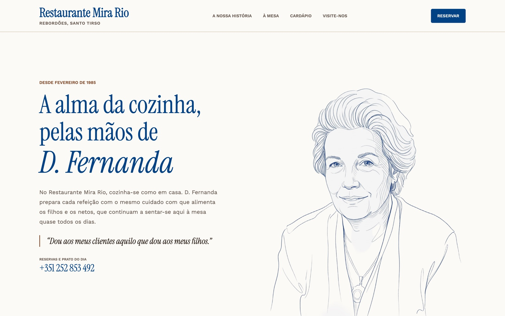
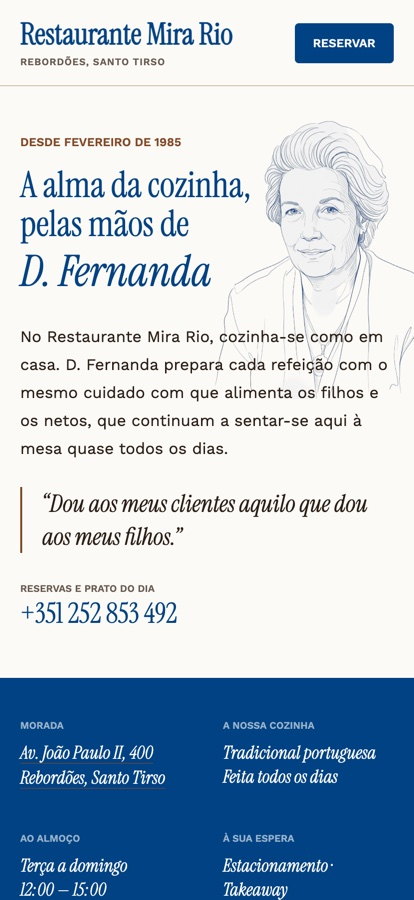
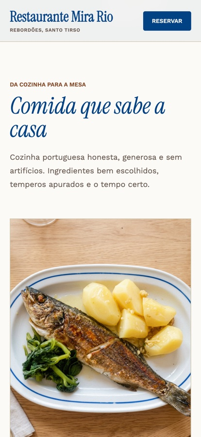
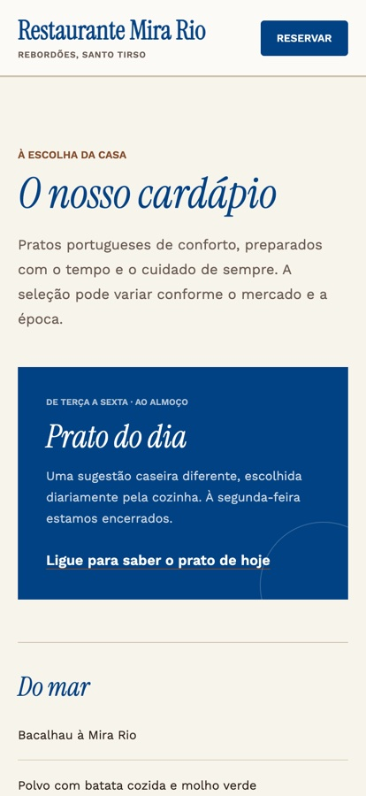
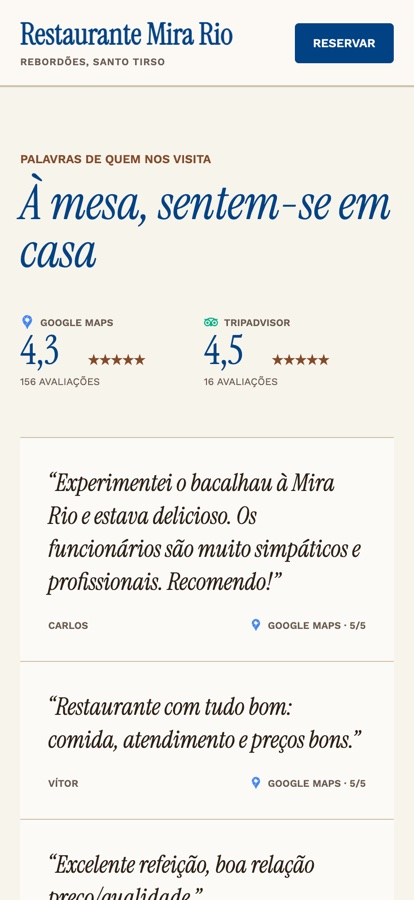

# Restaurante Mira Rio

**DISCLAIMER: I have used AI (specifically [Lovable](https://lovable.dev)) heavily to build this website**

The website of Restaurante Mira Rio, my grandparents' restaurant in Rebordões, Santo Tirso,
in the north of Portugal. It opened in February 1985 within sight of the Rio Ave, and
D. Fernanda has run it, and cooked in it, for more than thirty years. Her children and
grandchildren (including my father, my aunt and my cousins) still eat there almost every day,
and that is the case the site makes for the food: she serves it to her own family first.

For someone deciding where to have lunch, the page does three things. It says what kind of
place this is, it shows what is cooked there, and it keeps the phone number one tap away,
because the phone is how the restaurant takes bookings and how you find out the dish of the
day. It is written in European Portuguese.

**[Visit the site](https://restaurantemirario.com)**

  

## What is on the page

| Section | What it answers |
|---|---|
| **A nossa história** | Who cooks here. The headline, the drawing of D. Fernanda, and the number to call for a table or the dish of the day. |
| **The blue band** | The practical four: the address, which opens in Google Maps, the kind of cooking, the lunch hours, and parking, takeaway and the cards it takes. |
| **À mesa** | What the food is like, in three pictures: grilled fish, a roast and the dining room. |
| **Cardápio** | What you can order. Dishes from the sea and from the land, and the prato do dia, served Tuesday to Friday and told over the phone. |
| **Reviews** | What other people think. The Google Maps and Tripadvisor ratings, each linking to its source, and three reviews quoted from Google Maps. |
| **The river** | Why it has lasted. A wide picture of the Rio Ave, and the line the site is built on: quality proven first at the family's own table. |
| **Visite-nos** | How to get there and when. Address, hours, phone, email, and the link to the Livro de Reclamações, the official complaints book that Portuguese law asks businesses to link from their websites. |

  
  
  
  

## Licence

All rights reserved. The source is published to be read, not reused, and that includes the
drawing of D. Fernanda and the restaurant's name.

Afonso Azevedo, 2026.
